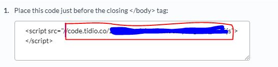

# wp-tidio-backend
A simple WordPress plugin that adds the tidio chat widget to the Administrative area of Wordpress.

Author: Frank Carentz - Sparrow Media
Date: 2/7/2019


## Install

### Step 1
Upload wp-tidio-backend directory into your WordPress plugin directory

### Step 2
Edit wp-config.php Add the following

Find the line that reads 
> /* That's all, stop editing! Happy blogging. */

Above it add this define command
```php
define('SPARROW_TIDIO', 'REPLACE_ME_WITH_WIDGET_URL');
```

### Step 3
Replace 'REPLACE_ME_WITH_WIDGET_URL' with your src URL found in tidio

Your chat widget in tidio can be found [HERE](https://www.tidiochat.com/panel/channels/widget/integration)

Copy the URL that we've circled in red from Tidio and paste over the 'REPLACE_ME_WITH_WIDGET_URL'



### Step 4
Activate the Plugin.

### Step 5
Enjoy!!!!


